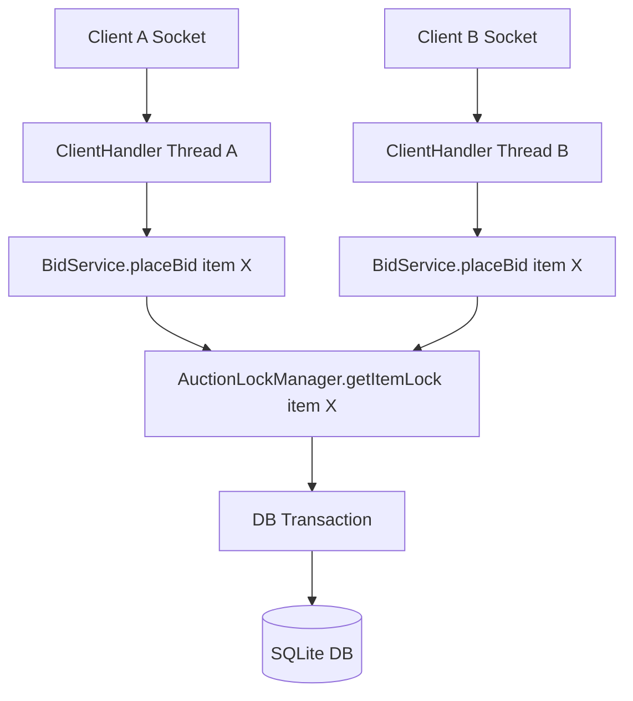
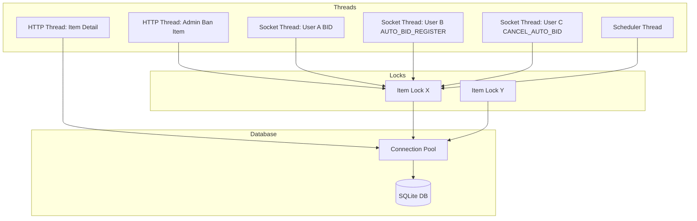
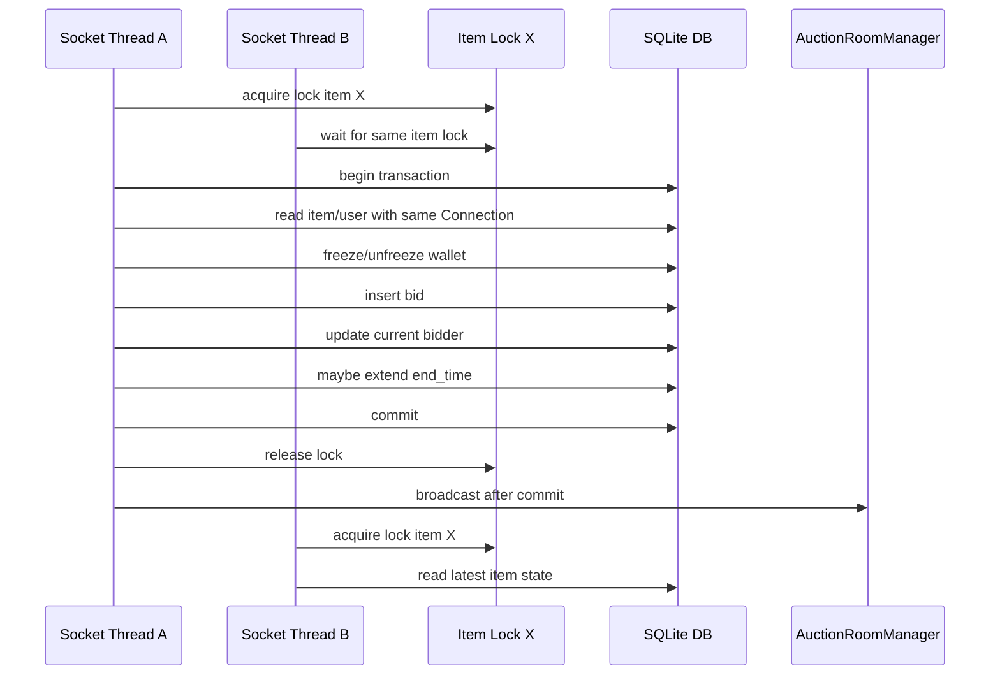

# 19. Thread model, pools, client handling, and database concurrency

This section documents the actual server threading and synchronization model in the repository. The goal is to separate four different concepts that often get mixed together:

- Java execution threads
- Per-item Java locks
- Database connections and transactions
- Socket broadcasts after committed state changes

The main classes inspected are:

- `com.auction.server.MainServer`
- `com.auction.server.socket.handler.ClientHandler`
- `com.auction.server.socket.room.AuctionRoomManager`
- `com.auction.server.service.auction.AuctionSchedulerService`
- `com.auction.server.database.DatabaseManager`
- `com.auction.server.service.auction.AuctionLockManager`
- `com.auction.server.service.bid.BidService`
- `com.auction.server.service.item.ItemService`
- `com.auction.server.service.auction.AuctionSettlementService`

## 19.1 HTTP request thread pool

The HTTP server is created in `MainServer.main(...)`.

Actual implementation:

```java
HttpServer httpServer = HttpServer.create(new InetSocketAddress(8080), 0);
registerHttpRoutes(httpServer);
ExecutorService httpExecutor = Executors.newFixedThreadPool(50);
httpServer.setExecutor(httpExecutor);
httpServer.start();
```

`HttpServer.setExecutor(...)` is used. The executor is `Executors.newFixedThreadPool(50)`, so up to 50 HTTP handler tasks can execute concurrently. Additional accepted HTTP exchanges are queued by the HTTP server/executor instead of creating unlimited handler threads.

Registered HTTP routes in `MainServer.registerHttpRoutes(...)` include:

| Route | Handler | Main action |
| --- | --- | --- |
| `/api/login` | `LoginHandler` | login |
| `/api/register` | `RegisterHandler` | register |
| `/api/verify-account` | `VerifyHandler` | verify account |
| `/api/send-otp` | `SendOtp` | send OTP |
| `/api/items` | `ItemsHandler` | get items, create item |
| `/api/items/ban` | `BanItemHandler` | admin ban item |
| `/api/users/ban` | `BanUserHandler` | admin ban user |
| `/api/users` | `GetUsersHandler` | list users |
| `/api/items/` | `ItemDetailHandler` | get, update, delete item |
| `/api/history/` | `HistoryHandler` | history |
| `/api/mybids` | `MyBidsHandler` | user bid history |
| `/api/chatbot` | `ChatBotHandler` | chatbot |
| `/api/wallet/deposit` | `WalletHandler.DepositHandler` | deposit |
| `/api/auction/settle` | `WalletHandler.SettleHandler` | settlement endpoint |
| `/api/wallet/balance` | `WalletHandler.BalanceHandler` | wallet balance |

These actions run on HTTP request threads:

- Login: `LoginHandler.handle(...) -> AuthService.login(...)`
- Get items: `ItemsHandler.handle(...) -> ItemService.getItems(...)`
- Admin ban item: `BanItemHandler.handle(...) -> ItemService.banItem(...)`
- Admin ban user: `BanUserHandler.handle(...) -> UserService.banUser(...)`
- Item create: `ItemsHandler.handle(...) -> ItemService.addItem(...)`
- Item update: `ItemDetailHandler.handle(...) -> ItemService.updateItem(...)`
- Item delete: `ItemDetailHandler.handle(...) -> ItemService.deleteItem(...)`
- Settlement endpoint: `WalletHandler.SettleHandler.handle(...) -> AuctionSettlementService.settleAuction(...)`

HTTP admin actions can race with socket bidding actions because they run on different Java threads:

- HTTP handlers run in the fixed HTTP executor.
- Socket clients run in separate `ClientHandler` threads.
- The scheduler runs in its own scheduled executor.

For item-level changes, the conflict boundary is the item id. `ItemService.banItem(...)`, `BidService.placeBid(...)`, `BidService.registerAutoBidAndMaybeBid(...)`, `BidService.cancelAutoBid(...)`, scheduler ending, and settlement use `AuctionLockManager.getItemLock(itemId)` to serialize work for the same item. Other HTTP flows, such as `ItemService.updateItem(...)`, `ItemService.deleteItem(...)`, and `UserService.banUser(...)`, do not take an item lock in the current code.

## 19.2 Socket server and client handling

The socket server is also started in `MainServer.main(...)`, after the HTTP server starts.

Actual implementation:

```java
try (ServerSocket serverSocket = new ServerSocket(9090)) {
    while (true) {
        Socket clientSocket = serverSocket.accept();
        ClientHandler handler = new ClientHandler(clientSocket);
        activeClients.add(handler);

        Thread clientThread = new Thread(handler);
        clientThread.start();
    }
}
```

Important details:

- The socket server listens on port `9090`.
- `serverSocket.accept()` runs in the main socket accept loop.
- Each accepted socket gets a new `ClientHandler`.
- Each `ClientHandler` is run by a dedicated `Thread`.
- There is no bounded socket worker pool in the current code; concurrency is limited by OS/JVM resources.
- `MainServer.activeClients` is a `CopyOnWriteArrayList<ClientHandler>`.

`ClientHandler.run()` reads one line at a time from the socket:

```java
while ((jsonRequest = in.readLine()) != null) {
    RequestMessage request = gson.fromJson(jsonRequest, RequestMessage.class);
    switch (request.getAction()) {
        case BID -> { ... }
        case JOIN_ROOM -> ...
        case LEAVE_ROOM -> ...
        case AUTO_BID_REGISTER -> { ... }
        case GET_AUTO_BID_STATUS -> { ... }
        case CANCEL_AUTO_BID -> { ... }
    }
}
```

Socket events and bidding-related behavior:

| Socket event | Handler method | Bidding effect |
| --- | --- | --- |
| `BID` | `bidAction(...)` | Calls `bidService.placeBid(itemId, userId, bidPrice)` |
| `AUTO_BID_REGISTER` | `autoBidRegisterAction(...)` | Calls `bidService.registerAutoBidAndMaybeBid(...)` |
| `CANCEL_AUTO_BID` | `cancelAutoBidAction(...)` | Calls `bidService.cancelAutoBid(itemId, userId)` |
| `GET_AUTO_BID_STATUS` | `getAutoBidStatusAction(...)` | Reads auto-bid status via `BidService` |
| `JOIN_ROOM` | `joinRoomAction(...)` | Joins the room and reads auto-bid status via `new BidService().getAutoBidStatus(...)`; it does not place a bid |
| `LEAVE_ROOM` | `leaveRoomAction()` | Leaves the room |

Two clients bidding at the same time means two different `ClientHandler` threads may call `BidService.placeBid(...)` concurrently. If both target the same item, they contend on the same item lock.



## 19.3 AuctionRoomManager and room state

`AuctionRoomManager` is a singleton:

```java
private static final AuctionRoomManager instance = new AuctionRoomManager();
private final Map<String, CopyOnWriteArrayList<ClientHandler>> rooms =
        new ConcurrentHashMap<>();
```

Room membership:

- Room key: item id string.
- Room value: `CopyOnWriteArrayList<ClientHandler>`.
- `joinRoom(...)` uses `rooms.computeIfAbsent(...)` and `addIfAbsent(...)`.
- `leaveRoom(...)` removes the client and removes the room entry if the list becomes empty.
- `removeClientFromAllRooms(...)` iterates `rooms.keySet()` and calls `leaveRoom(...)`.

Actual join code:

```java
rooms.computeIfAbsent(itemId, k -> new CopyOnWriteArrayList<>()).addIfAbsent(client);
```

Thread-safety properties:

- `ConcurrentHashMap` makes room lookup, insert, and remove thread-safe at the map level.
- `CopyOnWriteArrayList` makes iteration during broadcast safe from `ConcurrentModificationException`.
- `addIfAbsent(...)` avoids duplicate membership for the same `ClientHandler`.
- `rooms.remove(itemId, currentRoom)` avoids removing a room if another thread replaced the list.

Broadcast implementation:

```java
CopyOnWriteArrayList<ClientHandler> currentRoom = rooms.get(itemId);
String jsonMessage = gson.toJson(response);
for (ClientHandler client : currentRoom) {
    try {
        client.sendMessage(jsonMessage);
    } catch (Exception e) {
        LOGGER.warning(...);
    }
}
```

`ClientHandler.sendMessage(...)` is synchronized:

```java
public synchronized void sendMessage(String jsonMessage) {
    if (out != null) {
        out.println(jsonMessage);
    }
}
```

What happens under concurrent join/leave/broadcast:

- A broadcast iterates a snapshot-style `CopyOnWriteArrayList`.
- A client joining while a broadcast is already iterating may not receive that in-flight message.
- A client leaving while a broadcast is already iterating might still be present in the broadcast snapshot.
- Broadcast failures are logged per client.
- Broadcast failure does not rollback a successful DB transaction.
- Disconnected clients are removed in `ClientHandler.closeResources()` by calling `MainServer.activeClients.remove(this)` and `roomManager.removeClientFromAllRooms(this)`.
- `AuctionRoomManager.broadcastToRoom(...)` does not remove a client just because one send fails.

`BidService.placeBid(...)` and `BidService.registerAutoBidAndMaybeBid(...)` collect `BidEvent`s inside the item lock and DB transaction, commit, exit the synchronized block, and only then call `broadcastAllBidEvents(...)`. This means socket broadcasts for bids happen after commit and outside the item lock.

`BanItemHandler` uses a different broadcast path. After `ItemService.banItem(...)` returns success, it broadcasts an `ITEM_BANNED` message to every `ClientHandler` in `MainServer.activeClients`.

## 19.4 Scheduler thread

`AuctionSchedulerService` creates its own scheduled executor:

```java
private final ScheduledExecutorService scheduler =
        Executors.newSingleThreadScheduledExecutor();
```

It starts with:

```java
scheduler.scheduleAtFixedRate(() -> {
    try {
        checkAndUpdateStatuses();
    } catch (Exception e) {
        LOGGER.log(Level.SEVERE, "Auction scheduler tick failed", e);
    }
}, 0, 5, TimeUnit.SECONDS);
```

Actual behavior:

- The scheduler uses `newSingleThreadScheduledExecutor()`.
- It runs every 5 seconds.
- It uses `scheduleAtFixedRate(...)`.
- Because the executor has one thread, two scheduler ticks do not execute at the same time inside that executor.
- If one tick takes longer than the period, the next execution waits for the scheduler thread instead of overlapping with the previous tick.

Scheduler internal overlap is prevented by the single-thread scheduled executor. Scheduler vs socket bid race is still possible because socket handlers run on separate `ClientHandler` threads. Scheduler vs HTTP admin race is still possible because HTTP handlers run in the fixed HTTP executor.

Current scheduler flow:

```java
public void checkAndUpdateStatuses() {
    itemRepository.updateStatus();
    List<String> expiredIds = itemRepository.findOngoingExpiredItemIds();
    for (String id : expiredIds) {
        if (markExpiredAuctionEnded(id)) {
            settlementService.settleAuction(id);
        }
    }
}
```

Ending an expired auction uses the same item lock as bidding:

```java
synchronized (AuctionLockManager.getItemLock(itemId)) {
    try (Connection conn = DatabaseManager.getConnection()) {
        conn.setAutoCommit(false);
        LocalDateTime now = LocalDateTime.now();
        Item item = itemRepository.findById(conn, itemId);
        if (item == null
                || item.getStoredStatus() != AuctionStatus.ONGOING
                || item.getEndTime().isAfter(now)) {
            conn.rollback();
            return false;
        }

        if (!itemRepository.markEndedIfStillExpired(conn, itemId, now)) {
            conn.rollback();
            return false;
        }

        conn.commit();
        return true;
    }
}
```

The conditional repository update is:

```sql
UPDATE items
SET status = ?
WHERE id = ?
  AND status = ?
  AND datetime(end_time) <= datetime(?)
```

This is important because the scheduler first finds candidate ids, but another thread may update the same item before the scheduler processes a specific id. The scheduler therefore re-reads the item inside the lock and transaction, re-checks `storedStatus == ONGOING`, re-checks `endTime <= now`, and then updates with a conditional `WHERE`.

`ItemRepository.updateStatus()` does not batch-end `ONGOING` auctions in the current code. It only handles the safe `UPCOMING -> ONGOING` transition:

```sql
UPDATE items
SET status = ?
WHERE status = ?
  AND datetime(start_time) <= datetime('now','localtime')
  AND datetime(end_time) > datetime('now','localtime')
```

Expired `ONGOING` auctions are handled by the scheduler flow above, not by a broad batch update.

## 19.5 Database connection pool

A database connection pool is not a thread pool.

- A thread pool controls which Java tasks run concurrently.
- A connection pool controls reusable DB connections.
- One Java thread may borrow one connection during a transaction.
- Multiple Java threads may borrow different connections at the same time.
- SQLite still has write-lock limits even with multiple connections.
- WAL mode improves read/write concurrency, but it does not allow unlimited concurrent writes.
- `busy_timeout` helps a connection wait for locks, but it is not a substitute for correct transaction design.

`DatabaseManager` uses HikariCP:

```java
HikariConfig config = new HikariConfig();
config.setJdbcUrl("jdbc:sqlite:" + dbPath);
config.setConnectionInitSql(
        "PRAGMA journal_mode=WAL; " +
                "PRAGMA busy_timeout=5000; " +
                "PRAGMA synchronous=NORMAL;");
config.setMaximumPoolSize(10);
config.setMinimumIdle(2);

dataSource = new HikariDataSource(config);
```

Current DB pool/pragmas:

| Setting | Current code |
| --- | --- |
| Pool implementation | HikariCP: `HikariDataSource` |
| JDBC URL | `jdbc:sqlite:` + `AppConfig.getDbPath()` |
| Maximum pool size | `10` |
| Minimum idle | `2` |
| WAL | `PRAGMA journal_mode=WAL` in `DatabaseManager`; also executed in `DatabaseInit` |
| busy timeout | `PRAGMA busy_timeout=5000` |
| synchronous | `PRAGMA synchronous=NORMAL` |
| foreign keys | Not configured in production `DatabaseManager`; test support enables `PRAGMA foreign_keys = ON` |

Repository/service connection usage is mixed:

- Transactional service methods open one connection, call `conn.setAutoCommit(false)`, and pass that same `Connection conn` into repositories.
- Standalone repository methods without a `Connection` parameter open their own connection with `DatabaseManager.getConnection()`.
- Reads that are part of a bid transaction must use connection-bound methods.
- Simple read endpoints, such as item detail or item list, often use standalone repository methods.

| Concept | Meaning | Example in this project |
| --- | --- | --- |
| Thread pool | Runs Java tasks concurrently | HTTP handlers / socket handlers / scheduler |
| Connection pool | Reuses DB connections | `DatabaseManager.getConnection()` |
| Transaction | Atomic group of SQL statements | bid + wallet + item update |
| SQLite write lock | DB-level writer serialization | concurrent write contention |

## 19.6 Why connection-bound repository methods matter

These connection-bound methods are important in the auction bidding flow:

- `itemRepository.findById(conn, itemId)`
- `userRepository.findById(conn, userId)`
- `bidRepository.createBid(conn, ...)`
- `itemRepository.updateCurrentBidder(conn, ...)`
- `itemRepository.extendEndTime(conn, ...)`
- `bidRepository.deactivateAutoBidIfPresent(conn, ...)`

Bug pattern:

```java
try (Connection conn = DatabaseManager.getConnection()) {
    conn.setAutoCommit(false);

    Item item = itemRepository.findById(itemId); // wrong if it opens another connection

    // later writes use conn
    itemRepository.updateCurrentBidder(conn, itemId, price, userId);

    conn.commit();
}
```

This is wrong because:

- The read is outside the transaction.
- It may see stale or inconsistent state.
- Rollback cannot rollback reads or writes done on a different connection.
- The transaction boundary becomes fake.
- SQLite can serialize writers, but that does not make an unrelated connection part of the transaction.

Correct pattern:

```java
try (Connection conn = DatabaseManager.getConnection()) {
    conn.setAutoCommit(false);

    Item item = itemRepository.findById(conn, itemId);
    User user = userRepository.findById(conn, userId);

    // all critical writes use the same conn

    conn.commit();
}
```

Current `BidService.placeBid(...)` follows the correct pattern:

- It acquires `AuctionLockManager.getItemLock(itemId)`.
- It opens one `Connection`.
- It calls `conn.setAutoCommit(false)`.
- It reads the item with `itemRepository.findById(conn, itemId)`.
- It reads the user with `userRepository.findById(conn, userId)`.
- It writes bid/wallet/item state through connection-bound repository methods.
- It commits before broadcasting.

Critical write return values are checked in the current bid flow:

- `bidRepository.createBid(conn, ...)`
- `itemRepository.updateCurrentBidder(conn, ...)`
- `itemRepository.extendEndTime(conn, ...)`

`BidService.cancelAutoBid(...)` also uses a connection-bound repository method:

```java
boolean deactivated =
        bidRepository.deactivateAutoBidIfPresent(conn, itemId, userId);
```

## 19.7 Lock creation and lifecycle

`AuctionLockManager` is implemented as:

```java
public class AuctionLockManager {
    private static final ConcurrentMap<String, Object> ITEM_LOCKS =
            new ConcurrentHashMap<>();

    private AuctionLockManager() {}

    public static Object getItemLock(String itemId) {
        return ITEM_LOCKS.computeIfAbsent(itemId, ignored -> new Object());
    }
}
```

Actual details:

- The field type is `ConcurrentMap<String, Object>`.
- The concrete map is `new ConcurrentHashMap<>()`.
- The key is `String itemId`.
- The lock value is a plain `Object`.
- Lookup uses `computeIfAbsent(...)`.
- There is no cleanup/eviction logic for old item ids.

Why this works:

- `ConcurrentHashMap` makes lock lookup thread-safe.
- `computeIfAbsent` ensures the same `itemId` gets the same lock object.
- Same `itemId` means same critical section.
- Different `itemId`s can run concurrently.
- This is better than a global lock because bids on item A do not block bids on item B.

Lifecycle limitation:

- The map may grow if many item ids are created and never cleaned up.
- For coursework/demo usage this is usually acceptable.
- Production code may need cleanup, weak references, or another lifecycle strategy.

## 19.8 How `synchronized` works in this project

The core pattern is:

```java
synchronized (AuctionLockManager.getItemLock(itemId)) {
    // critical section
}
```

Meaning:

- Java locks the object returned by `getItemLock(itemId)`.
- Only one thread can hold that object monitor at a time.
- Other threads using the same `itemId` must wait.
- Threads using other `itemId`s can continue.
- `synchronized` is reentrant, so the same thread can re-enter the same lock if needed.
- `synchronized` automatically releases the lock when the block exits, even on exception.

Example:

```text
Thread A: BID item X -> acquires Lock X
Thread B: BID item X -> waits for Lock X
Thread C: BID item Y -> acquires Lock Y and continues
```

Current users of item locks include:

- `BidService.placeBid(...)`
- `BidService.registerAutoBidAndMaybeBid(...)`
- `BidService.cancelAutoBid(...)`
- `AuctionSchedulerService.markExpiredAuctionEnded(...)`
- `AuctionSettlementService.settleAuction(...)`
- `ItemService.banItem(...)`

## 19.9 Why not method-level synchronized

This would be a bad fit:

```java
public synchronized boolean placeBid(...) {
    ...
}
```

Reason:

- It locks the whole `BidService` instance.
- Bid on item A blocks bid on item B.
- Throughput becomes unnecessarily low.
- It does not express the real conflict boundary.
- The real conflict boundary is item-level state, so the lock should be by `itemId`.
- The current code creates separate `BidService` instances in separate `ClientHandler`s, so instance-level synchronization would also be easy to misunderstand.

The current per-item lock expresses the real contention point more accurately.

## 19.10 Lock ordering and deadlock risk

For the main bid flow, the current order is:

1. Acquire item lock.
2. Open DB connection.
3. Begin transaction with `conn.setAutoCommit(false)`.
4. Read item/user and validate.
5. Do wallet and bid DB work.
6. Commit or rollback.
7. Close connection.
8. Release item lock.
9. Broadcast socket events after commit and outside the item lock.

For scheduler ending:

1. Find expired candidate ids outside the item lock.
2. For each item id, acquire the item lock.
3. Open DB connection and begin transaction.
4. Re-read item with `findById(conn, itemId)`.
5. Re-check stored status and end time.
6. Conditionally mark ended.
7. Commit or rollback.
8. Release item lock.
9. Call settlement after the mark-ended transaction succeeds.

For settlement:

1. Acquire item lock.
2. Open DB connection and begin transaction.
3. Read item.
4. Check idempotency through `txLogRepo.existsAuctionPayment(conn, itemId)`.
5. Deduct winner frozen balance and credit seller.
6. Mark item ended and write wallet transaction logs.
7. Commit.
8. Send congratulations email after commit.
9. Close connection and release item lock.

Important detail: the email is sent after DB commit, but still inside the `synchronized` block in `AuctionSettlementService.settleAuction(...)`. That means the DB transaction is no longer open during email sending, but the item lock is still held until the method returns.

For `ItemService.banItem(...)`, the actual order is:

1. Acquire item lock.
2. Open DB connection and begin transaction.
3. Read item with `findById(conn, itemId)`.
4. Mark item `BANNED`.
5. If there is a current bidder, unfreeze that bidder's current price and log the unfreeze.
6. Deactivate all auto-bids for the item.
7. Commit.
8. Release item lock.
9. `BanItemHandler` broadcasts `ITEM_BANNED` to `MainServer.activeClients`.

General rules:

- Do not acquire multiple item locks unless necessary.
- Do not hold an item lock while waiting for unrelated external I/O.
- Do not broadcast socket events before commit.
- Do not broadcast inside a DB transaction.
- Do not call long network/email operations while a DB transaction is open.
- If email is required, it should be after commit; ideally it should also happen outside item locks.

| Operation | Inside item lock | Inside DB transaction | Why |
| --- | ---: | ---: | --- |
| Validate item state | Yes | Yes | Must use latest serialized state |
| Freeze/unfreeze wallet | Yes | Yes | Must be atomic with bid |
| Insert bid | Yes | Yes | Must match item current bidder |
| Update current bidder | Yes | Yes | Must match bid log |
| Anti-snipe extend | Yes | Yes | Must be atomic with bid |
| Socket broadcast | Prefer no | No | Only after commit |
| Email | Prefer no | No | External I/O should not block DB transaction |

Deadlock risk is low in the current item-bid path because it takes only one item lock at a time. Risk increases if future code takes multiple item locks or holds item locks while doing long external I/O.

## 19.11 SQLite concurrency and transaction behavior

SQLite concurrency model:

- SQLite allows many readers.
- SQLite allows limited concurrent writers; effectively, writes are serialized at the database level.
- WAL mode improves read/write concurrency.
- `busy_timeout=5000` lets a connection wait for a locked database instead of failing immediately.
- `conn.setAutoCommit(false)` starts a transaction context; in SQLite, work is often deferred until the first statement that needs a lock.

Project-specific behavior:

- Java item locks reduce write contention for the same item.
- Different items can be bid on concurrently at the Java lock level.
- SQLite may still serialize concurrent writes even for different items.
- Wallet operations can contend if the same user bids on multiple different items, because those flows use different item locks but update the same `users` row.
- SQL conditional updates protect wallet correctness:
  - `freezeAmount(...)` uses `WHERE id = ? AND balance >= ?`.
  - `unfreezeAmount(...)` uses `WHERE id = ? AND frozen_balance >= ?`.
  - `deductFromFrozen(...)` uses `WHERE id = ? AND frozen_balance >= ?`.
- Scheduler ending uses a conditional item update:
  - `WHERE id = ? AND status = 'ONGOING' AND datetime(end_time) <= datetime(?)`.

The distinction is:

```text
Java lock protects in-process concurrency.
SQLite transaction protects database atomicity.
SQL WHERE conditions protect correctness even if state changed before update.
```

Production multi-instance deployment would need more than these in-process Java locks. If two JVMs run the same server, their `AuctionLockManager` maps are separate and do not synchronize with each other. A production deployment should rely on DB-level constraints, optimistic locking/version columns, row locks where the DB supports them, or distributed locks.

## 19.12 Handler-level flow from client message to service

Socket `BID` request:

```text
Client UI
-> socket JSON message
-> ClientHandler reads message with BufferedReader.readLine()
-> Gson parses RequestMessage
-> switch dispatches BID
-> ClientHandler.bidAction(...)
-> BidPayload parsed from request payload
-> BidService.placeBid(itemId, userId, price)
-> acquire AuctionLockManager item lock
-> open DB connection
-> begin transaction
-> read item/user with same Connection
-> freeze/unfreeze wallet
-> insert bid
-> update current bidder
-> maybe extend end_time for anti-snipe
-> run auto-bid rounds with same Connection
-> commit
-> close connection
-> release item lock
-> AuctionRoomManager.broadcastToRoom(...)
-> client UI updates
```

HTTP admin ban item request:

```text
Admin UI
-> HTTP PUT /api/items/ban/{itemId}
-> HTTP handler thread from fixed pool
-> BanItemHandler.handle(...)
-> ItemService.banItem(itemId)
-> acquire AuctionLockManager item lock
-> open DB connection
-> begin transaction
-> read item with same Connection
-> mark item BANNED
-> unfreeze current bidder if present
-> log unfreeze if balances can be read
-> deactivate all auto-bids for the item
-> commit
-> close connection
-> release item lock
-> BanItemHandler broadcasts ITEM_BANNED to active socket clients
-> HTTP response
```

The admin ban item flow above is the actual implementation order. It differs from a possible conceptual order where unfreeze/deactivate might be listed before mark banned.

HTTP admin ban user request:

```text
Admin UI
-> HTTP POST /api/users/ban
-> HTTP handler thread from fixed pool
-> BanUserHandler.handle(...)
-> UserService.banUser(adminId, targetUserId)
-> read target user with standalone repository read
-> open DB connection
-> begin transaction
-> update user status to Suspended
-> deactivate all auto-bids for that user
-> commit
-> HTTP response
```

`UserService.banUser(...)` does not acquire item locks in the current code. It can race with socket bidding flows that already loaded user state before the ban commits. Bids that load the user after the ban commits should see the suspended status and fail validation.

## 19.13 Complete concurrency diagrams





## 19.14 Thread-safety checklist

| Area | Must be true | Current status |
| --- | --- | --- |
| HTTP server | Uses bounded executor or documented default | Found: `MainServer` uses `Executors.newFixedThreadPool(50)` and `httpServer.setExecutor(httpExecutor)` |
| Socket client handling | Each client/message can run concurrently | Found: each accepted socket gets a `ClientHandler` and a new dedicated `Thread`; messages from one client are processed sequentially by that handler loop |
| Scheduler | Uses single scheduled executor | Found: `AuctionSchedulerService` uses `Executors.newSingleThreadScheduledExecutor()` |
| BidService | Uses per-item lock | Found: `placeBid(...)` and `registerAutoBidAndMaybeBid(...)` synchronize on `AuctionLockManager.getItemLock(itemId)` |
| cancelAutoBid | Uses same item lock | Found: `cancelAutoBid(...)` synchronizes on `AuctionLockManager.getItemLock(itemId)` |
| Scheduler ending | Uses same item lock | Found: `markExpiredAuctionEnded(...)` synchronizes on `AuctionLockManager.getItemLock(itemId)` |
| Repository reads in transaction | Use same `Connection conn` | Found for bid and scheduler critical reads: `findById(conn, itemId)`, `userRepository.findById(conn, userId)`; simple read endpoints may use standalone connections |
| DB writes | Check return value | Found for critical bid writes and wallet writes; some repository methods such as auto-bid deactivation return true after executing even if row count is zero |
| Rollback | Explicit rollback on failure | Found in bid, auto-bid registration, cancel auto-bid, scheduler ending, item ban, user ban, and settlement flows |
| Broadcast | After commit | Found for `BidService` socket broadcasts; `BanItemHandler` broadcasts after `ItemService.banItem(...)` returns success |
| Room manager | Thread-safe room membership | Found: `ConcurrentHashMap` plus `CopyOnWriteArrayList` |
| DatabaseManager | Pool/WAL/busy_timeout documented | Found: HikariCP, max pool 10, min idle 2, WAL, busy timeout 5000, synchronous NORMAL |
| SQLite runtime files | `db-shm/db-wal` not part of logic | Found: logic uses `DatabaseManager` and SQLite DB path; `*.db-shm`/`*.db-wal` are SQLite runtime artifacts, not business logic |

## 19.15 Limitations specifically about threads and DB

Current limitations and caveats:

- `synchronized` works only inside one JVM process.
- If the server is scaled to multiple JVMs, per-item Java locks will not synchronize across processes.
- SQLite is not ideal for high-write concurrent production workloads.
- DB-level unique constraints are stronger than application-only idempotency checks.
- A distributed system would need DB row locks, optimistic locking/version columns, or distributed locks.
- Socket event ordering can still be improved with item version/sequence number.
- Connection pool size does not mean all writes can proceed concurrently in SQLite.
- Long-running transactions can block other writers.
- Email/network I/O should not be done inside an open DB transaction.
- `AuctionSettlementService` sends congratulations email after commit, but still while holding the item lock.
- `UserService.banUser(...)` does not acquire all affected item locks, so it can race with in-progress bids that already loaded user state.
- `ItemService.addItem(...)` starts AI indexing through `CompletableFuture.runAsync(...)`; this is another asynchronous execution path outside the HTTP request thread after item creation.
- `ItemService.updateItem(...)` and `ItemService.deleteItem(...)` do not take the per-item auction lock in the current code.
- `AuctionRoomManager.broadcastToRoom(...)` logs send failures but does not remove clients on broadcast failure; normal disconnect cleanup happens in `ClientHandler.closeResources()`.
- `DatabaseManager` configures WAL and `busy_timeout`, but production `DatabaseManager` does not explicitly enable `PRAGMA foreign_keys = ON`.

## 19.16 Final mental model

```text
Thread pool decides how many tasks can run at the same time.
AuctionLockManager decides which tasks must wait because they touch the same item.
DB transaction decides which SQL changes commit or rollback together.
SQL conditional update decides whether the row is still valid to update.
Socket broadcast happens only after the database state is already correct.
```
